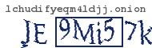

# 基于GAN的验证码破解

本项目是对暗网Dream Market的验证码进行破解，并实现自动登陆爬取功能。

使用opencv生成验证码，SimGAN对验证码在像素级别上进行修改并训练，使得判别器(Discriminator)无法区分生成的验证码与真实验证码，最后用数据增强(data augmentation)的方式增加真实验证码的训练数据，并用迁移训练(transfer learning)对生成的模型进行调优。最后能够达到整体验证码正确率大于90%，单个字符正确率大于97%。

TODO
